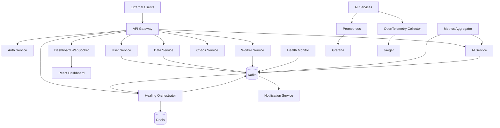

# NeuralMesh

AI-driven self-healing distributed microservices platform.

NeuralMesh is a full local portfolio system that demonstrates microservices, event-driven telemetry, AI anomaly detection, automated healing, chaos engineering, observability, RBAC, Docker Compose, and Kubernetes/Helm deployment.

The original product documentation is preserved at [docs/source-documentation.md](/C:/aiSelfHealer/docs/source-documentation.md). The implementation checklist that maps requirements to code lives at [docs/implementation-checklist.md](/C:/aiSelfHealer/docs/implementation-checklist.md).

## What Is Included

- 10 runnable services:
  - API Gateway: Express reverse proxy with JWT validation, Redis-backed token bucket rate limiting, cache headers, WebSocket fan-out, and dynamic routes.
  - Auth Service: Express auth API with RS256 JWTs, refresh rotation, token blacklist, RBAC claims, and audit events.
  - User Service: Fastify REST API with tenant-aware user CRUD.
  - Data Service: FastAPI CQRS API with idempotency keys, PostgreSQL/TimescaleDB schema support, audit events, and Prometheus metrics.
  - Worker Service: FastAPI background job API with priority queues, retry/backoff, and dead-letter tracking.
  - AI Service: FastAPI plus gRPC anomaly inference with Isolation Forest, LSTM-style sequence scoring, predictive scaling, RCA, MLflow metadata, and drift checks.
  - Metrics Aggregator: Kafka consumer/sliding-window service that calls the AI Service and emits anomaly/scale events.
  - Healing Orchestrator: circuit breaker state machine, simulated Docker/Kubernetes restart hooks, reroute flags, and healing event stream.
  - Notification Service: Express alert router with Slack/email/webhook dry-run support, dedupe, and notification history.
  - Health Monitor: Go service registry and health polling loop that publishes service health/down events.
- Chaos module with API and CLI experiments for pod kill, latency, partition, CPU stress, memory pressure, Kafka disruption, DB connection exhaustion, and DNS failure simulation.
- React/Vite dashboard with live service graph, metrics explorer, anomaly feed, healing log, scaling history, RBAC-aware controls, and Socket.io updates.
- Docker Compose with Kafka, Zookeeper, Redis, TimescaleDB/Postgres, Prometheus, Grafana, Loki, Promtail, Jaeger, OpenTelemetry Collector, Alertmanager, Vault, MinIO, MLflow, and every app service.
- Kubernetes Helm chart with deployments, services, HPA, NetworkPolicy, RBAC, ConfigMap, Secret placeholders, Ingress, and optional Istio policy samples.
- GitHub Actions CI, security scan workflow, k6 load test, docs, and demo scripts.

## Quick Start

1. Create local env:

```powershell
Copy-Item .env.example .env
```

2. Install Node dependencies:

```powershell
npm install
```

3. Install Python dependencies for local service tests:

```powershell
python -m pip install -r requirements-dev.txt
```

4. Start infrastructure and services:

```powershell
docker compose up --build
```

5. Open the dashboard:

```text
http://localhost:5173
```

Key service URLs:

| Component | URL |
|---|---|
| API Gateway | http://localhost:8080 |
| Auth Service | http://localhost:3001 |
| User Service | http://localhost:3002 |
| Data Service | http://localhost:8001 |
| Worker Service | http://localhost:8002 |
| AI Service | http://localhost:8003 |
| Metrics Aggregator | http://localhost:8004 |
| Healing Orchestrator | http://localhost:8005 |
| Chaos Service | http://localhost:8006 |
| Notification Service | http://localhost:3003 |
| Health Monitor | http://localhost:8090 |
| Prometheus | http://localhost:9090 |
| Grafana | http://localhost:3000 |
| Jaeger | http://localhost:16686 |
| Alertmanager | http://localhost:9093 |
| MLflow | http://localhost:5000 |
| Vault | http://localhost:8200 |
| MinIO | http://localhost:9001 |

## Demo Flow

```powershell
.\scripts\demo.ps1
```

The demo script logs in, creates telemetry, triggers an anomaly, starts a chaos experiment, watches healing state, and shows notification/scaling history.

## Test Commands

```powershell
npm test
Push-Location services\data-service; python -m pytest tests; Pop-Location
Push-Location services\worker-service; python -m pytest tests; Pop-Location
Push-Location services\ai-service; python -m pytest tests; Pop-Location
Push-Location services\metrics-aggregator; python -m pytest tests; Pop-Location
Push-Location services\healing-orchestrator; python -m pytest tests; Pop-Location
Push-Location services\chaos-service; python -m pytest tests; Pop-Location
go test ./services/health-monitor/...
```

## Architecture



## Notes

The Docker Compose setup is designed for local demonstration. Some cloud-native features are intentionally represented by safe local implementations:

- Vault PKI and dynamic DB users are configured but default to dev tokens locally.
- mTLS assets are generated as local placeholders; Istio manifests show the production path.
- Docker/Kubernetes restarts are simulated when the relevant local socket or kubeconfig is unavailable.
- Slack/email/webhook delivery defaults to dry-run unless credentials are provided.
