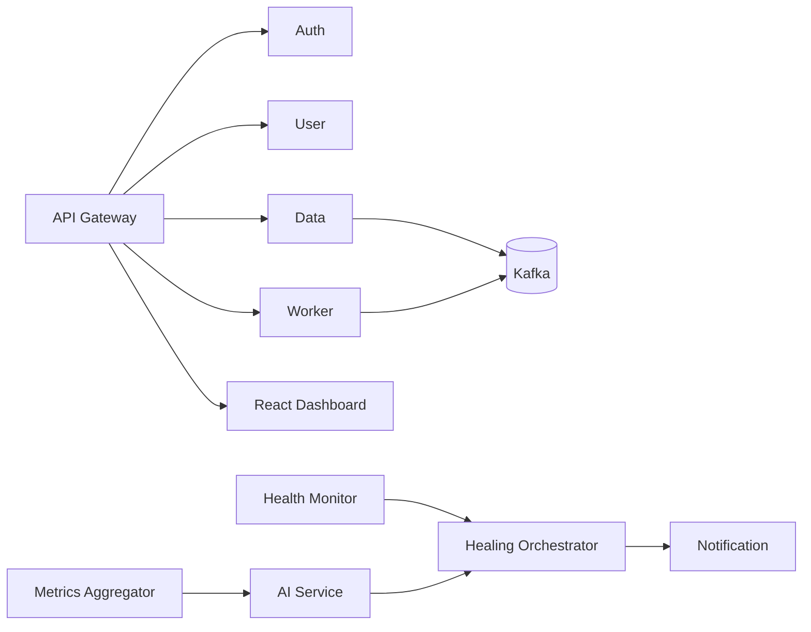

# Architecture

NeuralMesh uses a gateway-centered mesh for local development:

- External requests enter through the API Gateway.
- JWT validation and rate limiting happen before proxying.
- Services emit immutable Kafka-style events using the envelope in `contracts/events.json`.
- Metrics flow into the Metrics Aggregator, then into the AI Service.
- Anomalies trigger Healing Orchestrator actions and Notification Service delivery.
- Health Monitor polls service `/health` endpoints every five seconds.
- Prometheus, Loki, Jaeger, Grafana, and Alertmanager provide the observability plane.

## Failure Flow

1. Chaos Service simulates or injects a failure.
2. Health Monitor emits `service.down`.
3. Metrics Aggregator sends a sliding 60-second window to AI Service.
4. AI Service combines Isolation Forest and sequence probability scores.
5. Healing Orchestrator opens a circuit, sets reroute state, and simulates restart.
6. Notification Service deduplicates and sends the alert.
7. Dashboard receives the event over Socket.io.

